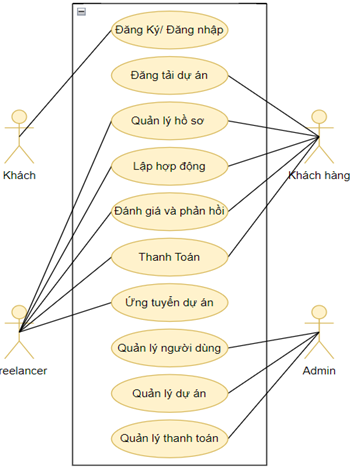

# Freelance Marketplace

Freelance Marketplace là một nền tảng trực tuyến kết nối các freelancer với khách hàng có nhu cầu thuê dịch vụ. Hệ thống này giúp quá trình hợp tác trở nên an toàn, minh bạch và hiệu quả, từ việc đăng dự án, tuyển chọn freelancer, đến thanh toán và đánh giá.

## 🎯 Mô Tả Đề Tài
Freelance Marketplace là một nền tảng kết nối trực tiếp giữa freelancer và khách hàng (cá nhân hoặc doanh nghiệp). Nó cung cấp một môi trường làm việc và giao dịch thuận tiện, an toàn cho cả hai bên, hỗ trợ toàn bộ quy trình từ tìm kiếm dự án, đăng tải dự án, quản lý công việc, thanh toán, và đánh giá sau khi hoàn thành dự án.

## ⚙️ Các Chức Năng Cơ Bản

| Tính Năng              | Mô Tả                                                                                 |
|------------------------|---------------------------------------------------------------------------------------|
| **Đăng ký/Đăng nhập**  | Người dùng có thể đăng ký và đăng nhập qua email hoặc mạng xã hội (Google, Facebook).  |
| **Quản lý hồ sơ**       | Freelancer có thể tạo và cập nhật hồ sơ cá nhân bao gồm kỹ năng, kinh nghiệm.         |
| **Đăng dự án**          | Khách hàng có thể đăng các dự án chi tiết để freelancer ứng tuyển.                    |
| **Ứng tuyển dự án**     | Freelancer có thể tìm kiếm dự án và gửi đề xuất báo giá cho khách hàng.               |
| **Lập hợp đồng**        | Hợp đồng tự động được tạo khi khách hàng chấp nhận đề xuất từ freelancer.             |
| **Thanh toán**          | Hỗ trợ thanh toán an toàn qua escrow, giữ tiền cho đến khi hoàn thành dự án.          |
| **Đánh giá & phản hồi** | Khách hàng và freelancer có thể đánh giá lẫn nhau sau khi dự án kết thúc.             |

## 🛠️ Công Nghệ Sử Dụng

| Công Nghệ        | Mô Tả                                                                                       |
|------------------|---------------------------------------------------------------------------------------------|
| **Frontend**     | Sử dụng **Next.js** với tính năng SSR và CSR để tối ưu tốc độ tải trang và trải nghiệm người dùng. |
| **Backend**      | **.NET Core** API để xử lý nghiệp vụ và quản lý dữ liệu.                                    |
| **Cơ sở dữ liệu** | **SQL Server** dùng để lưu trữ thông tin người dùng, dự án và giao dịch.                   |
| **Thanh toán**   | Tích hợp **Stripe** và **PayPal** để xử lý các giao dịch thanh toán an toàn.                |
| **Bảo mật**      | Sử dụng **JWT** để xác thực và **SSL** để mã hóa dữ liệu trong quá trình truyền tải.        |

## 🌟 Mục Tiêu
- Tạo một nền tảng an toàn và minh bạch cho freelancer và khách hàng.
- Hỗ trợ quy trình tìm kiếm, quản lý dự án và thanh toán trực tuyến an toàn, tiện lợi.
- Giúp khách hàng dễ dàng tìm kiếm và hợp tác với freelancer phù hợp với dự án của họ.

## 📄 License
Dự án được mô tả chi tiết trong file SRS - [Xem tài liệu chi tiết](./SRS.docx) để xem chi tiết.
