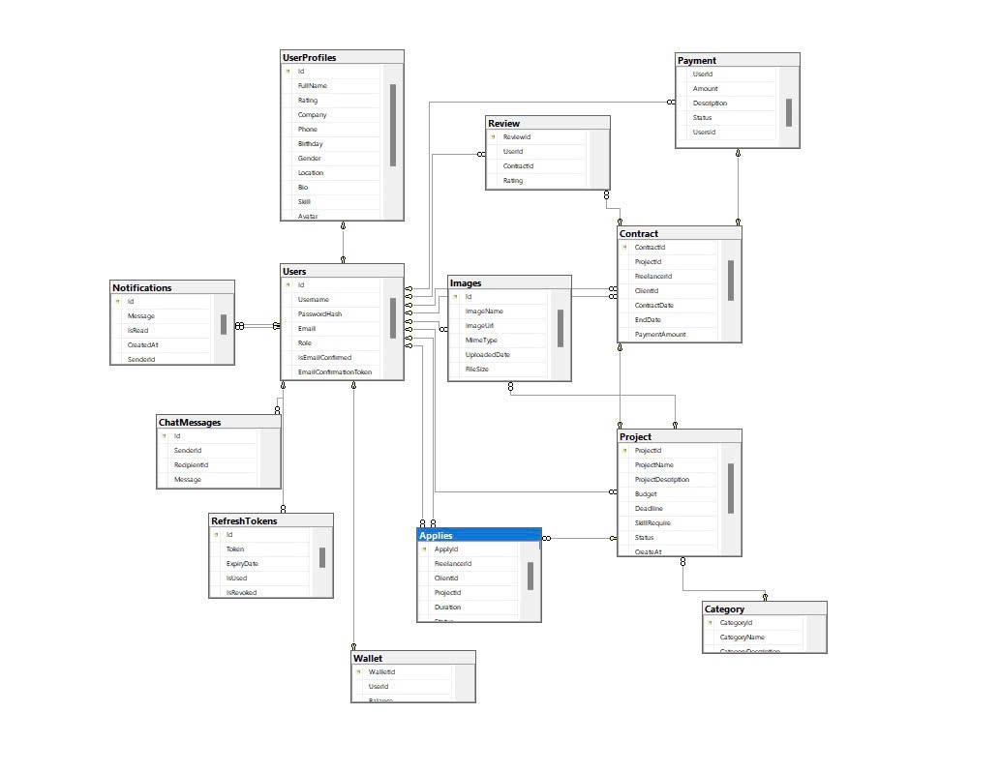

# Freelance-Marketplace_XDPMHDT
A simple freelance project management tool of UTH with task tracking, milestone management, file sharing, and payment integration for seamless collaboration.

# FE_XDPMHDT Project Setup Guide

## Prerequisites
- Node.js (version 16+ recommended)
- npm (version 8+)
- Git

## Clone Repository
```bash
git clone [URL_REPOSITORY_GIT]
cd [PROJECT_FOLDER_NAME]
```

## Install Dependencies
```bash
npm install
```

## Environment Configuration
1. Copy `.env.example` to `.env`
2. Update environment variables as needed

## Run Development Server
```bash
npm run start
```

## Build Production Version
```bash
npm run build
```

## Project Structure
- `src/`: Source code directory
- `public/`: Public assets
- `package.json`: Project dependencies and scripts

## Troubleshooting
- Ensure Node.js and npm are correctly installed
- Clear npm cache if dependency issues occur: `npm cache clean --force`
- Check console for specific error messages

# Freelance Marketplace




Freelance Marketplace là một nền tảng trực tuyến kết nối các freelancer với khách hàng có nhu cầu thuê dịch vụ. Hệ thống này giúp quá trình hợp tác trở nên an toàn, minh bạch và hiệu quả, từ việc đăng dự án, tuyển chọn freelancer, đến thanh toán và đánh giá.

## 🎯 Mô Tả Đề Tài
Freelance Marketplace là một nền tảng kết nối trực tiếp giữa freelancer và khách hàng (cá nhân hoặc doanh nghiệp). Nó cung cấp một môi trường làm việc và giao dịch thuận tiện, an toàn cho cả hai bên, hỗ trợ toàn bộ quy trình từ tìm kiếm dự án, đăng tải dự án, quản lý công việc, thanh toán, và đánh giá sau khi hoàn thành dự án.

## ⚙️ Các Chức Năng Cơ Bản

| Tính Năng              | Mô Tả                                                                                 |
|------------------------|---------------------------------------------------------------------------------------|
| **Đăng ký/Đăng nhập**  | Người dùng có thể đăng ký và đăng nhập qua email hoặc mạng xã hội (Google, Facebook).  |
| **Quản lý hồ sơ**       | Freelancer có thể tạo và cập nhật hồ sơ cá nhân bao gồm kỹ năng, kinh nghiệm.         |
| **Đăng dự án**          | Khách hàng có thể đăng các dự án chi tiết để freelancer ứng tuyển.                    |
| **Ứng tuyển dự án**     | Freelancer có thể tìm kiếm dự án và gửi đề xuất báo giá cho khách hàng.               |
| **Lập hợp đồng**        | Hợp đồng tự động được tạo khi khách hàng chấp nhận đề xuất từ freelancer.             |
| **Thanh toán**          | Hỗ trợ thanh toán an toàn qua escrow, giữ tiền cho đến khi hoàn thành dự án.          |
| **Đánh giá & phản hồi** | Khách hàng và freelancer có thể đánh giá lẫn nhau sau khi dự án kết thúc.             |

## 🛠️ Công Nghệ Sử Dụng

| Công Nghệ        | Mô Tả                                                                                       |
|------------------|---------------------------------------------------------------------------------------------|
| **Frontend**     | Sử dụng **Next.js** với tính năng SSR và CSR để tối ưu tốc độ tải trang và trải nghiệm người dùng. |
| **Backend**      | **.NET Core** API để xử lý nghiệp vụ và quản lý dữ liệu.                                    |
| **Cơ sở dữ liệu** | **SQL Server** dùng để lưu trữ thông tin người dùng, dự án và giao dịch.                   |
| **Thanh toán**   | Tích hợp **Stripe** và **PayPal** để xử lý các giao dịch thanh toán an toàn.                |
| **Bảo mật**      | Sử dụng **JWT** để xác thực và **SSL** để mã hóa dữ liệu trong quá trình truyền tải.        |

## 🌟 Mục Tiêu
- Tạo một nền tảng an toàn và minh bạch cho freelancer và khách hàng.
- Hỗ trợ quy trình tìm kiếm, quản lý dự án và thanh toán trực tuyến an toàn, tiện lợi.
- Giúp khách hàng dễ dàng tìm kiếm và hợp tác với freelancer phù hợp với dự án của họ.

# Hướng Dẫn Cài Đặt Dự Án Freelance Marketplace

## Điều Kiện Tiên Quyết
- Visual Studio 2022 (khuyến nghị phiên bản Community Edition)
- .NET Core SDK 6.0 trở lên
- SQL Server 2019 hoặc mới hơn
- Git

## Bước 1: Clone Mã Nguồn
```bash
# Mở Terminal hoặc Command Prompt
git clone [URL_REPOSITORY]
cd [TÊN_THƯ_MỤC_DỰ_ÁN]
```

## Bước 2: Cấu Hình Cơ Sở Dữ Liệu
1. Mở SQL Server Management Studio
2. Tạo Database mới:
```sql
CREATE DATABASE FreelanceMarketplace
```
3. Cập nhật connection string trong `Program.cs`:
```cs
builder.Services.AddDbContext<AppDbContext>(options =>
    options.UseSqlServer(
        connectionString: "Data Source=DESKTOP-1FAVEMH\\SQLEXPRESS;Initial Catalog=FreelanceMarketplace;Integrated Security=True;trusted_connection=true;encrypt=false;", \\thay ở đây
        sqlServerOptionsAction: sqlOptions =>
        {
            sqlOptions.EnableRetryOnFailure(
                maxRetryCount: 5,
                maxRetryDelay: TimeSpan.FromSeconds(30),
                errorNumbersToAdd: null);
        }),
    contextLifetime: ServiceLifetime.Scoped,
    optionsLifetime: ServiceLifetime.Singleton
);
```

## Bước 3: Migrations và Khởi Tạo Cơ Sở Dữ Liệu
```bash
# Mở Terminal tại thư mục project Backend
dotnet ef migrations add InitialCreate
dotnet ef database update

# Hoặc mở Tools -> NuGet Package Manager -> Package Manager Console
Add-Migration InitialCreate
Update-Database
```

## Bước 4: Cài Đặt Dependencies
```bash
# Restore packages NuGet
dotnet restore
```

## Bước 5: Chạy Ứng Dụng
```bash
# Chạy Backend
dotnet run

# Nếu sử dụng Visual Studio
# - Mở solution
# - Nhấn F5 hoặc nút Start
```

## Khắc Phục Sự Cố
- Kiểm tra version .NET Core
- Đảm bảo connection string chính xác
- Cài đầy đủ dependencies


## Lưu Ý Bảo Mật
- Không commit các file chứa thông tin nhạy cảm
- Sử dụng Secret Manager của .NET Core
- Luôn sử dụng HTTPS

## Tài Liệu Tham Khảo
- [Tài liệu .NET Core](https://docs.microsoft.com/dotnet)
- [Entity Framework Core](https://docs.microsoft.com/ef)

## 📄 License
Dự án được mô tả chi tiết trong file SRS - [Xem tài liệu chi tiết](./SRS.docx) để xem chi tiết.